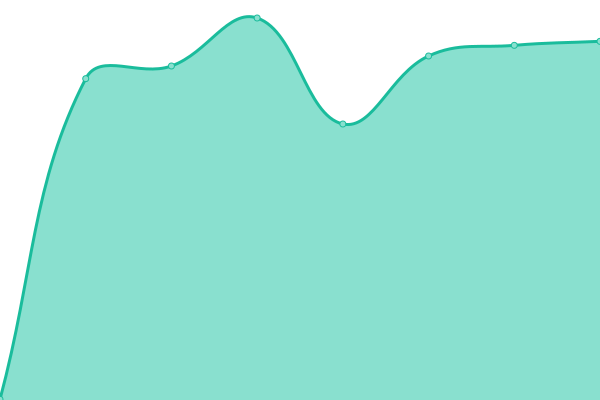

# [📈 Live Status](https://status.cpe-lab.com): <!--live status--> **🟩 All systems operational**

This repository contains the open-source uptime monitor and status page for [Upptime](https://upptime.js.org), powered by [Upptime](https://github.com/upptime/upptime).

With [Upptime](https://upptime.js.org), you can get your own unlimited and free uptime monitor and status page, powered entirely by a GitHub repository. We use [Issues](https://github.com/upptime/upptime/issues) as incident reports, [Actions](https://github.com/cpe-lab/status.cpe-lab.com/actions) as uptime monitors, and [Pages](https://status.cpe-lab.com) for the status page.

<!--start: status pages-->
<!-- This summary is generated by Upptime (https://github.com/upptime/upptime) -->
<!-- Do not edit this manually, your changes will be overwritten -->
<!-- prettier-ignore -->
| URL | Status | History | Response Time | Uptime |
| --- | ------ | ------- | ------------- | ------ |
|  [Mikrotik-1](http://mikrotik-1.cpe-lab.com:9980/) | 🟩 Up | [mikrotik-1.yml](https://github.com/cpe-lab/status.cpe-lab.com/commits/HEAD/history/mikrotik-1.yml) | 

 456ms
     
 | 

<a href="https://status.cpe-lab.com/history/mikrotik-1">100.00%</a>
    

|  [Mikrotik-2](http://mikrotik-2.cpe-lab.com:9980/) | 🟩 Up | [mikrotik-2.yml](https://github.com/cpe-lab/status.cpe-lab.com/commits/HEAD/history/mikrotik-2.yml) | 

 457ms
     
 | 

<a href="https://status.cpe-lab.com/history/mikrotik-2">100.00%</a>
    

|  [NokiaCL](https://nokiacl.fpt.vn/) | 🟩 Up | [nokia-cl.yml](https://github.com/cpe-lab/status.cpe-lab.com/commits/HEAD/history/nokia-cl.yml) | 

 2254ms
     
 | 

<a href="https://status.cpe-lab.com/history/nokia-cl">100.00%</a>
    

|  [PWIFI-FAS](http://fas.pwifi.cpe-lab.com:9988/) | 🟩 Up | [pwifi-fas.yml](https://github.com/cpe-lab/status.cpe-lab.com/commits/HEAD/history/pwifi-fas.yml) | 

 449ms
     
 | 

<a href="https://status.cpe-lab.com/history/pwifi-fas">100.00%</a>
    

<!--end: status pages-->

[**Visit our status website →**](https://status.cpe-lab.com)

## 📄 License

- Powered by: [Upptime](https://github.com/upptime/upptime)
- Code: [MIT](./LICENSE) © [Upptime](https://upptime.js.org)
- Data in the `./history` directory: [Open Database License](https://opendatacommons.org/licenses/odbl/1-0/)
